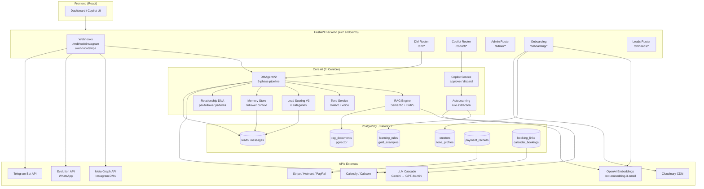

# CLONNECT — SYSTEM AUDIT COMPLETO
**Para: Ingenieros entrantes + Beta Testing con Stefano**
**Fecha**: 2026-02-26 | **Branch**: main | **Tests**: 366/366 PASS

---

## 1. ¿QUÉ ES CLONNECT?

Clonnect es un **SaaS de clonación digital con IA para creadores de contenido hispanohablantes**. Permite que un creador con 50k–500k seguidores delegue la gestión completa de su bandeja de DMs de Instagram (y WhatsApp/Telegram) a un agente de IA que replica su voz, su tono y sus productos. El "clon digital" responde como si fuera el propio creador, categoriza leads automáticamente, detecta intención de compra y facilita el cierre de ventas — todo ello con un modo copiloto que deja al creador aprobar/editar cada respuesta antes de enviarla.

**Propuesta de valor**: El creador no pierde tiempo respondiendo DMs individuales. El clon lo hace por él, con la misma calidad de respuesta, capturando oportunidades de venta 24/7.

**Usuario objetivo**: Creadores de contenido en España/LATAM (voseo rioplatense, español neutro, mexicano) que venden cursos, coaching, infoproductos o servicios, con audiencias de 50k–500k followers.

**Stack**: FastAPI (Python 3.11) + PostgreSQL/NeonDB + pgvector + React 18/TypeScript + Railway (deploy) + Gemini Flash-Lite → GPT-4o-mini (LLM cascade).

---

## 2. MAPA DE SISTEMAS

### A. NÚCLEO DE IA — El Cerebro

---

#### A1. DM Pipeline (5 fases)
**Archivos**: `core/dm_agent_v2.py` (orquestador), `core/dm/phases/` (detection.py, context.py, generation.py, postprocessing.py)

**Qué hace**: Recibe un mensaje de texto de un follower y produce una respuesta personalizada en 5 fases secuenciales:

| Fase | Archivo | Función |
|------|---------|---------|
| 1. Detection | `phases/detection.py` | Detecta frustración (0.0–1.0), edge cases, fast-path pool responses |
| 2. Context | `phases/context.py` | Clasifica intención, carga contexto del follower, DNA, memoria, RAG |
| 3. Memory | `phases/context.py` | Estado conversacional, compromisos, instrucciones per-follower |
| 4. Generation | `phases/generation.py` | Construye prompt, llama LLM, inyecta ejemplos gold |
| 5. Post-processing | `phases/postprocessing.py` | Valida tono, longitud, guardrails, variación |

**Dependencias internas**: RAG, ToneService, LeadService, MemoryStore, IntentClassifier, RelationshipDNA, FrustrationDetector, Guardrails, PromptBuilder, ChainOfThoughtReasoner

**APIs externas**: OpenAI (GPT-4o-mini, embeddings), Google (Gemini Flash-Lite, primary), Anthropic (fallback)

**Tablas DB**: `messages`, `leads`, `conversation_state_db`, `conversation_summary`, `learning_rules`, `gold_examples`, `rag_documents`, `follower_memory_db`, `relationship_dna`

**Estado**: ✅ FUNCIONAL — v2.5, producción. Orquestador <500 LOC, fases modulares. Circuit breaker con Gemini (threshold=2, cooldown=120s).

---

#### A2. RAG / Knowledge Engine
**Archivos**: `core/rag/semantic.py`, `core/rag/bm25.py`, `core/rag/reranker.py`, `core/embeddings.py`

**Qué hace**: Dado el mensaje del follower, recupera los documentos más relevantes del knowledge base del creador para que el LLM pueda citarlos en su respuesta (anti-alucinación).

- **Semantic**: OpenAI `text-embedding-3-small` (1536 dims) + pgvector cosine similarity
- **BM25**: búsqueda léxica paralela (fallback)
- **Hybrid**: fusión weighted (70% semántico, 30% BM25), configurable via env
- **Reranker**: cross-encoder opcional (`ENABLE_RERANKING=true`)
- **Cache**: TTL 5 min por (query, creator_id)
- **Skip intents**: greeting, farewell, thanks (no RAG needed)

**APIs externas**: OpenAI Embeddings API

**Tablas DB**: `rag_documents` (doc_id, creator_id, content, embedding pgvector, metadata JSONB)

**Estado**: ✅ FUNCIONAL — embeddings persistentes (sobreviven deploys), cache activo.

---

#### A3. Personality Extraction (Tone + Bot Config)
**Archivos**: `core/tone_service.py`, `ingestion/tone_analyzer.py`, `core/personality_extraction/`

**Qué hace**: A partir de los posts de Instagram del creador, extrae su "huella digital" de comunicación:
- Dialecto: `rioplatense | mexicano | español | neutral`
- Voz: formal/informal, uso de emojis, longitud típica de respuestas
- Vocabulario signature (palabras que usa / evita)
- Genera el `ToneProfile` que se inyecta en cada prompt del agente

**Tablas DB**: `tone_profiles` (JSON), `style_profile_model`, `personality_docs` (doc_type: doc_d = bot config, doc_e = copilot rules)

**Estado**: ✅ FUNCIONAL — persistencia DB + JSON fallback. ⚠️ PARCIAL: `PersonalityDoc` (doc_d/doc_e) extraído pero no totalmente integrado en todos los flujos de generación.

---

#### A4. Lead Scoring & Categorización V3
**Archivos**: `services/lead_scoring.py`

**Qué hace**: Sistema de clasificación en 6 categorías flat (sin jerarquía):

```
1. cliente      — Compra confirmada (status preservado, score 75-100)
2. caliente     — Intención de compra detectada (score 45-85)
3. colaborador  — Keywords de colaboración ≥2 (score 30-60)
4. amigo        — Engagement social bidireccional (score 15-45)
5. nuevo        — Reciente, señales bajas (score 0-25)
6. frío         — Inactivo 14+ días con historial previo (score 0-10)
```

**Algoritmo**:
1. `extract_signals()` → keywords purchase/interest/social/collab, ratio bidireccional, días inactividad
2. `classify_lead()` → categoría por prioridad ordenada
3. `calculate_score()` → score 0-100 dentro del rango de la categoría

**Nota crítica**: Solo los mensajes del follower (no del bot) cuentan para purchase intent.

**Tablas DB**: `leads` (status, score, purchase_intent), `messages`

**Estado**: ✅ FUNCIONAL — V3, testeado con matrices de keywords. 33 unit tests PASS.

---

#### A5. Audience Intelligence
**Archivos**: `services/audience_intelligence.py`, `api/routers/audience.py`, `api/routers/audiencia.py`

**Qué hace**: Agrega métricas de audiencia del creador:
- Segmentos de audiencia por categoría de leads
- Topics más discutidos en DMs
- Patrones de intención de compra por segmento
- Anomaly detection en engagement

**Tablas DB**: `leads`, `messages`, `lead_intelligence`, `creator_metrics_daily`

**Estado**: ✅ FUNCIONAL — endpoints returning 200 en producción.

---

### B. PLATAFORMA DE MENSAJERÍA

---

#### B1. Instagram Handler
**Archivos**: `core/instagram.py`, `core/instagram_handler.py`, `api/routers/messaging_webhooks/instagram_webhook.py`

**Qué hace**:
- **Recepción**: Webhook GET (verificación hub.challenge) + POST (mensajes entrantes)
- **Routing**: Identifica creator_id por `instagram_page_id` o `instagram_user_id`
- **Parsing**: DMs directos, story replies, comentarios, media (imágenes, audio, video)
- **Envío**: POST al Graph API `/conversations/{id}/messages`
- **Sync**: Fetch histórico de conversaciones vía Conversations API
- **Rate limiting**: `InstagramRateLimiter` con backoff exponencial

**APIs externas**: Meta Graph API v21.0

**Tablas DB**: `messages`, `leads`, `sync_queue`, `sync_state`, `instagram_posts`, `unmatched_webhooks`

**Estado**: ✅ FUNCIONAL — token refresh automático, rate limiter con circuit breaker.

---

#### B2. WhatsApp Handler (Evolution API)
**Archivos**: `api/routers/messaging_webhooks/evolution_webhook.py`, `core/whatsapp_handler.py`

**Qué hace**: Recibe mensajes de WhatsApp via Evolution API (wrapper open-source de WhatsApp Business), los parsea, crea/actualiza leads y responde via Evolution.

**APIs externas**: Evolution API (self-hosted WhatsApp Business wrapper)

**Tablas DB**: `messages`, `leads`

**Estado**: ✅ FUNCIONAL. ⚠️ Nota: usa Evolution API (no Meta oficial). Migración a Meta WhatsApp Business API oficial pendiente.

---

#### B3. Telegram Handler
**Archivos**: `core/telegram_adapter.py`, `core/telegram_registry.py`, `api/routers/messaging_webhooks/telegram_webhook.py`

**Qué hace**: Bot de Telegram con soporte de medios (foto, video, audio, documento), grupos vs DMs, inline keyboards. Identifica creador por `telegram_bot_token`.

**APIs externas**: Telegram Bot API

**Tablas DB**: `messages`, `leads`

**Estado**: ✅ FUNCIONAL.

---

#### B4. Copilot System
**Archivos**: `core/copilot/` (service.py, lifecycle.py, actions.py, messaging.py, models.py), `api/routers/copilot/`

**Qué hace**: Modo de asistencia al creador — el bot genera una sugerencia pero no la envía hasta que el creador la aprueba/edita.

**Workflow**:
1. DM entra → Bot genera sugerencia → `create_pending_response()` (debounce 2s)
2. Creador ve sugerencias en dashboard (`GET /copilot/{creator_id}/pending`)
3. Acciones: `approve` (envía tal cual), `edit+approve` (envía editado), `discard` (descarta), `manual_override` (creador escribe desde cero)
4. Cada acción dispara `analyze_creator_action()` en background (autolearning)

**Tablas DB**: `messages` (status=pending_approval), `copilot_evaluation`, `learning_rules`, `gold_examples`, `preference_pairs`

**Estado**: ✅ FUNCIONAL — debounce activo, autolearning conectado, endpoints 200 en producción.

---

#### B5. Nurturing Engine
**Archivos**: `services/nurturing_service.py`, `api/routers/nurturing.py`, `core/task_scheduler.py`

**Qué hace**: Secuencias de follow-up automáticas para leads que no respondieron:
- `NurturingSequence` con steps JSON (mensajes + delays)
- Ghost reactivation: detecta leads calientes inactivos 7+ días → reengagement DM
- Email nurturing con 4 niveles de discount codes
- `EmailAskTracking` para audit trail de peticiones de email

**Tablas DB**: `nurturing_sequences`, `nurturing_followups`, `email_ask_tracking`, `leads`, `messages`

**Estado**: ✅ FUNCIONAL — scheduler activo, ghost reactivation productivo.

---

### C. INFRAESTRUCTURA & DATA

---

#### C1. Auth & OAuth
**Archivos**: `api/auth.py`, `api/routers/oauth/` (google.py, status.py, calendly.py), `api/routers/connections.py`

**Qué hace**:
- **API Keys**: `require_creator_access` (header `X-API-Key`)
- **Admin Auth**: `require_admin` (header `CLONNECT_ADMIN_KEY`)
- **JWT**: `get_current_user` para frontend
- **OAuth flows**: Instagram, Google, Calendly, Cal.com

**Tablas DB**: `creators` (api_key, instagram_token), `sync_state`

**Estado**: ✅ FUNCIONAL. ⚠️ 9 endpoints HIGH PRIORITY sin auth documentados en `FINAL_GAPS_RESOLVED.md`.

---

#### C2. Database Layer
**Archivos**: `api/database.py`, `api/models.py`, `alembic/versions/` (39 migraciones)

**Tablas principales** (50+ total):

| Grupo | Tablas |
|-------|--------|
| Creator | `creators`, `creator_availability`, `tone_profiles`, `style_profile_model`, `personality_docs` |
| Lead | `leads`, `unified_leads`, `lead_activity`, `lead_task`, `lead_intelligence`, `dismissed_leads` |
| Message | `messages`, `conversation_state_db`, `conversation_summary`, `conversation_embedding`, `commitment_model`, `pending_messages` |
| Content | `products`, `product_analytics`, `content_chunks`, `instagram_posts`, `rag_documents`, `knowledge_base` |
| Learning | `learning_rules`, `gold_examples`, `preference_pairs`, `copilot_evaluation`, `clone_score_evaluation` |
| Payments | `payment_records`, `stripe_events` |
| Booking | `booking_links`, `calendar_bookings`, `booking_slots` |
| Nurturing | `nurturing_sequences`, `nurturing_followups`, `email_ask_tracking` |
| Analytics | `creator_metrics_daily`, `unified_profile`, `follower_memory_db` |
| Sync | `sync_queue`, `sync_state`, `unmatched_webhooks`, `relationship_dna` |

**Stack**: PostgreSQL (NeonDB), SQLAlchemy 2.0, pgvector 0.8.0 (HNSW indexes), Alembic migraciones, pool 5+5 conexiones.

**Estado**: ✅ FUNCIONAL — revision 035, FK integrity OK, HNSW indexes activos.

---

#### C3. Onboarding Pipeline
**Archivos**: `api/routers/onboarding.py`, `ingestion/pipeline.py`, `ingestion/deterministic_scraper.py`, `ingestion/structured_extractor.py`, `ingestion/tone_analyzer.py`

**Qué hace**: Configura el clon digital de un nuevo creador en 7 pasos:
1. Instagram OAuth → `instagram_token`, `page_id`, `user_id`
2. Fetch posts → `instagram_posts` table
3. `ToneAnalyzer` → `ToneProfile` desde captions
4. Scraping de website (si existe) → `DeterministicScraper` (sin LLM, regex)
5. `StructuredExtractor` → productos, FAQs, testimonios con source_url
6. Generación de embeddings → `rag_documents` con pgvector
7. `clone_status='complete'`, `copilot_mode=true`

**APIs externas**: Meta Graph API, OpenAI Embeddings

**Tablas DB**: `creators`, `instagram_posts`, `tone_profiles`, `products`, `rag_documents`, `knowledge_base`

**Estado**: ✅ FUNCIONAL — anti-alucinación (source_url obligatorio, price_verified flag).

---

#### C4. Sync Engine
**Archivos**: `core/dm_sync.py`, `api/routers/admin/sync_dm/`, `services/sync_worker.py`

**Qué hace**:
- Sync histórico de conversaciones de Instagram (cursor-based pagination)
- Lead creation automática por cada conversación nueva
- `SyncQueue` para operaciones asíncronas (status: pending → processing → complete/failed)
- Reconciliación de mensajes duplicados

**APIs externas**: Meta Graph API (Conversations API)

**Tablas DB**: `sync_queue`, `sync_state`, `messages`, `leads`, `unmatched_webhooks`

**Estado**: ✅ FUNCIONAL.

---

#### C5. Media Handling
**Archivos**: `services/cloudinary_service.py`, `api/routers/preview.py`, `core/link_preview.py`

**Qué hace**: Upload de medios a Cloudinary CDN, generación de previews de links, thumbnails de stories. ⚠️ Endpoints `/preview/*` detectados como SSRF risk (sin auth).

**APIs externas**: Cloudinary API

**Tablas DB**: `instagram_posts` (media_url, thumbnail_url)

**Estado**: ✅ FUNCIONAL para uploads. ⚠️ Preview endpoints sin auth (documented).

---

### D. ANALYTICS & BUSINESS INTELLIGENCE

---

#### D1. Dashboard Metrics
**Archivos**: `api/routers/dashboard.py`, `services/insights_engine.py`, `core/metrics.py`

**Qué hace**: Agrega métricas diarias/semanales para el creador:
- Mensajes recibidos/enviados, leads creados, conversiones
- Prometheus metrics (`/metrics` endpoint)
- `CreatorMetricsDaily` table con aggregaciones diarias

**Tablas DB**: `creator_metrics_daily`, `leads`, `messages`, `payment_records`

**Estado**: ✅ FUNCIONAL.

---

#### D2. Clone Score Engine
**Archivos**: `services/clone_score_engine.py`, `api/routers/clone_score.py`

**Qué hace**: Evalúa qué tan bien el clon imita al creador real. Compara respuestas del bot vs respuestas reales históricas en dimensiones: tono, longitud, vocabulario, emojis.

**Estado**: ⚠️ PARCIAL — lógica de scoring existe, framework de evaluación incompleto. Test sets en `tests/echo/`. Endpoint retorna 200 pero score puede ser `has_stats=False` si no hay suficiente data.

---

#### D3. Audience Intelligence & Predictions
**Archivos**: `api/routers/audience.py`, `api/routers/audiencia.py`, `api/routers/insights.py`, `api/routers/intelligence.py`

**Qué hace**: Segmentación de audiencia, topics de conversación, predicciones de conversión, recomendaciones de productos por segmento.

**Estado**: ✅ FUNCIONAL — endpoints 200 en producción.

---

### E. MONETIZACIÓN

---

#### E1. Payments (Multi-plataforma)
**Archivos**: `core/payments/`, `api/routers/payments.py`, `api/routers/webhooks.py`

| Plataforma | Webhook | Eventos |
|------------|---------|---------|
| Stripe | `POST /webhook/stripe` | checkout.session.completed, payment_intent.succeeded, invoice.paid |
| Hotmart | `POST /webhook/hotmart` | purchase, refund, chargeback |
| PayPal | `POST /webhook/paypal` | payment.sale.completed, payment.capture.completed |

Todos verifican firma HMAC-SHA256. Crean `PaymentRecord` y vinculan a `Lead`.

**Tablas DB**: `payment_records`, `stripe_events`, `leads`

**Estado**: ✅ FUNCIONAL.

---

#### E2. Product Management
**Archivos**: `api/routers/products.py`, `api/routers/creator.py`

**Qué hace**: CRUD de productos del creador (cursos, coaching, recursos). Cada producto tiene `payment_link`, `price`, `is_free`, `source_url`, `price_verified`.

**Tablas DB**: `products`, `product_analytics`

**Estado**: ✅ FUNCIONAL.

---

#### E3. Booking System
**Archivos**: `api/routers/booking.py`, `api/routers/calendar.py`, `api/routers/oauth/calendly.py`

**Qué hace**: Gestión de reservas de sesiones 1:1:
- Creador crea `BookingLink` (título, duración, precio, plataforma)
- Calendly/Cal.com OAuth y webhooks
- Webhook `booking.created` → `CalendarBooking` + lead vinculado

**APIs externas**: Calendly API, Cal.com API

**Tablas DB**: `booking_links`, `calendar_bookings`, `booking_slots`

**Estado**: ✅ FUNCIONAL.

---

### F. FRONTEND (React/TypeScript)

**Archivos**: `frontend/src/` (213 archivos TypeScript, 33 928 LOC)

| Módulo | Directorio | Qué hace |
|--------|-----------|----------|
| Dashboard | `pages/`, `components/` | Overview de métricas, leads activos |
| Copilot UI | `components/chat/` | Bandeja de sugerencias pendientes, approve/edit/discard |
| Lead Management | `components/leads/` | Lista de leads con score, categoría, historial |
| Analytics | `pages/Analytics/` | Gráficas de mensajes, conversiones, revenue |
| Settings | `components/settings/` | Configuración del creador, tone, automatización |
| Connections | — | OAuth flows (Instagram, WhatsApp, calendario) |
| Onboarding | `pages/new/` | Wizard de configuración inicial |
| Auth | `context/` | Estado de autenticación (JWT) |

**Estado**: ✅ FUNCIONAL — TypeScript, hooks API, context state management.

---

## 3. DIAGRAMA DE DEPENDENCIAS (Mermaid)



---

## 4. LOS 7 FLUJOS E2E CRÍTICOS

### Flujo 1: Incoming DM → Copilot Response
```
Instagram → Webhook → DMAgent (5 fases) → PendingResponse → Creador aprueba → Send → Learn
```
Ver: `diagrams/dm_pipeline_flow.mermaid`

### Flujo 2: OAuth & Onboarding
```
Creador → OAuth → Token → Scraping → Tone → Embeddings → Clone Ready
```
Ver: `diagrams/onboarding_flow.mermaid`

### Flujo 3: Lead Lifecycle
```
Nuevo follower → Lead created → Scoring → Caliente/Cliente → Nurturing → Conversión
```
Ver: `diagrams/lead_lifecycle.mermaid`

### Flujo 4: Copilot Approval Loop
```
Suggestion created → Dashboard → Approve/Edit/Discard → Send → AutoLearn
```
Ver: `diagrams/copilot_flow.mermaid`

### Flujo 5: RAG Retrieval
```
User message → Embed → pgvector search → BM25 fusion → Rerank → LLM injection
```
Ver: `diagrams/rag_pipeline.mermaid`

### Flujo 6: Payment → Lead Attribution
```
Webhook Stripe/Hotmart/PayPal → Verify HMAC → PaymentRecord → Lead status=cliente
```

### Flujo 7: Ghost Reactivation
```
Scheduler → detect inactive caliente leads → nurturing DM → re-engagement
```

---

## 5. MATRIZ DE DEPENDENCIAS CRUZADAS

| Sistema | PostgreSQL | Meta API | OpenAI | Gemini | Stripe | Cloudinary | Evolution | Telegram | Calendly | Lead Scoring | RAG | Tone | Memory |
|---------|-----------|----------|--------|--------|--------|------------|-----------|----------|----------|-------------|-----|------|--------|
| DM Agent V2 | ✅ | ❌ | ✅ emb | ✅ llm | ❌ | ❌ | ❌ | ❌ | ❌ | ✅ | ✅ | ✅ | ✅ |
| Instagram Handler | ✅ | ✅ | ❌ | ❌ | ❌ | ❌ | ❌ | ❌ | ❌ | ❌ | ❌ | ❌ | ❌ |
| WhatsApp Handler | ✅ | ❌ | ❌ | ❌ | ❌ | ❌ | ✅ | ❌ | ❌ | ❌ | ❌ | ❌ | ❌ |
| Telegram Handler | ✅ | ❌ | ❌ | ❌ | ❌ | ❌ | ❌ | ✅ | ❌ | ❌ | ❌ | ❌ | ❌ |
| RAG Engine | ✅ pgvec | ❌ | ✅ emb | ❌ | ❌ | ❌ | ❌ | ❌ | ❌ | ❌ | — | ❌ | ❌ |
| Lead Scoring | ✅ | ❌ | ❌ | ❌ | ❌ | ❌ | ❌ | ❌ | ❌ | — | ❌ | ❌ | ✅ |
| Copilot | ✅ | ✅ send | ❌ | ✅ | ❌ | ❌ | ❌ | ❌ | ❌ | ❌ | ❌ | ❌ | ❌ |
| AutoLearning | ✅ | ❌ | ✅ llm | ✅ | ❌ | ❌ | ❌ | ❌ | ❌ | ❌ | ❌ | ❌ | ❌ |
| Onboarding | ✅ | ✅ | ✅ emb | ❌ | ❌ | ✅ | ❌ | ❌ | ❌ | ❌ | ✅ | ✅ | ❌ |
| Payments | ✅ | ❌ | ❌ | ❌ | ✅ | ❌ | ❌ | ❌ | ❌ | ❌ | ❌ | ❌ | ❌ |
| Booking | ✅ | ❌ | ❌ | ❌ | ❌ | ❌ | ❌ | ❌ | ✅ | ❌ | ❌ | ❌ | ❌ |
| Nurturing | ✅ | ✅ send | ❌ | ✅ | ❌ | ❌ | ❌ | ❌ | ❌ | ✅ | ❌ | ✅ | ✅ |
| Clone Score | ✅ | ❌ | ✅ | ✅ | ❌ | ❌ | ❌ | ❌ | ❌ | ✅ | ✅ | ✅ | ❌ |

---

## 6. GAPS Y RIESGOS IDENTIFICADOS

### 🔴 GAP — Crítico (bloquea funcionalidad)

| # | Sistema | Gap | Impacto |
|---|---------|-----|---------|
| G1 | Auth | 9 endpoints HIGH sin `require_creator_access` | Data exposure en producción |
| G2 | WhatsApp | Evolution API (no-oficial) puede romper sin aviso | Caída del canal WA |
| G3 | Clone Score | Framework de evaluación incompleto | Métrica no confiable |

### 🟡 GAP — Importante (funcionalidad parcial)

| # | Sistema | Gap | Impacto |
|---|---------|-----|---------|
| G4 | Personality | Doc D/E no totalmente wired en todos los flujos de generación | Personalidad menos precisa |
| G5 | Reflexion Engine | `core/reflexion_engine.py` existe pero no integrado en DM pipeline | Calidad de respuestas |
| G6 | Best-of-N | Lógica de comparación hardcoded, no configurable | Inflexible |
| G7 | Preview endpoints | `/preview/*` sin auth → SSRF potential | Seguridad |

### 🟢 TODO — Nice to have (no bloquea beta)

| # | Sistema | TODO |
|---|---------|------|
| T1 | RAG | Caché semántico (invalidación por similitud) |
| T2 | Instagram | Cursor-based pagination para cuentas grandes |
| T3 | Multilenguaje | Response generation en inglés/portugués |
| T4 | WhatsApp | Migrar de Evolution a Meta WhatsApp Business API oficial |
| T5 | A/B Testing | Framework para comparar variaciones de respuesta |

---

## 7. RESUMEN DEL SISTEMA

| Dimensión | Valor |
|-----------|-------|
| API endpoints | 422 |
| Tablas DB | 50+ |
| Archivos Python | 895 |
| LOC Python | 152 390 |
| LOC Frontend | 33 928 |
| LLM Providers | Gemini (primary) → GPT-4o-mini (fallback) |
| Plataformas mensajería | Instagram, WhatsApp (Evolution), Telegram |
| Plataformas pago | Stripe, Hotmart, PayPal |
| Booking | Calendly, Cal.com |
| Media CDN | Cloudinary |
| DB Vector | pgvector 0.8.0 (HNSW) |
| Tests automatizados | 366/366 PASS (100%) |
| Estado | ✅ Listo para beta con Stefano |
